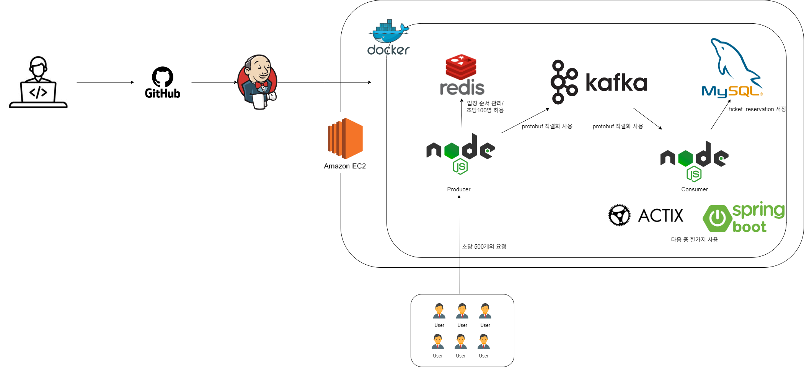

# 🎟️ Ticketing

이 프로젝트는 고트래픽 환경에서도 안정적으로 운영 가능한 티켓팅 시스템 백엔드 아키텍처를 목표로 제작되었습니다. 대규모 사용자 요청을 효율적으로 처리하고, 무결성과 확장성을 고려한 구조를 기반으로 합니다.

---

## Architecture Overview

## 제작 계획

- 최종 목표는 위 아키텍처이며, 단계별로 제작해서 진행 예정
- 단일 express 서버와 redis만을 사용해 ticket_reservation에 입장할수 있는 상태를 먼저 구현후, kafka를 이용한 MSA구조로 기능 확장

---

## 기술 스택 및 구성 요소

| 구성 요소 | 기술 |
|-----------|------|
| **API 서버 (Producer)** | Node.js (Express) |
| **비동기 메시징 큐** | Apache Kafka |
| **Consumer (예약 처리)** | Node.js or Spring Boot or Actix |
| **데이터베이스** | MySQL |
| **캐시 및 트래픽 제어** | Redis |
| **통신 방식** | protobuf |

---

## 흐름 설명

1. **사용자 요청 진입**
   - 대기열에 진입한 사용자는 Redis를 통해 입장 제한 (초당 100명)
   
2. **Producer**
   - Kafka Producer 역할을 하며, 요청을 Kafka Topic에 발행
   - node.js 사용

3. **Kafka**
   - 높은 TPS에서도 안정적인 요청 분산을 위해 사용

4. **Consumer**
   - Kafka 메시지를 소비하고, 비즈니스 로직(티켓 예약 처리)을 수행.
   - Actix or Spring Boot or node.js 사용 예정

5. **DB 저장**
   - 최종적으로 예약 내역은 MySQL에 저장.

---

## 성능 최적화 요소

- **Redis를 활용한 Rate Limiting**
-  **Kafka로 비동기 트래픽 분산**
-  **protobuf 통신**
-  **Docker 기반 서비스 단위 분리**

---

## 프로젝트 목적

- 대규모 트래픽에도 견디는 구조 설계
- 실무에서 사용되는 Kafka, Redis, gRPC, Docker 등 핵심 기술 학습
- 클라우드/마이크로서비스 기반 인프라 설계 실습

---
